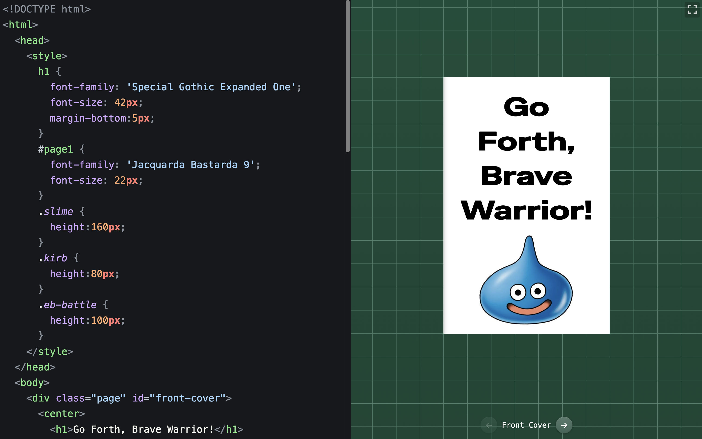

# if you have a printer, you're a publisher

<a href="https://hunterirving.github.io/zine_workshop/"></a>

#### 1. open <a href="https://hunterirving.github.io/zine_workshop/">zine workshop ↗</a> in your web browser
#### 2. use HTML to flesh out the pages
#### 3. press ```⌘ + P``` to print an 8-page mini zine to one sheet of 8.5 x 11" legal paper

<br>

<a href="https://hunterirving.github.io/zine_workshop/"></a>

>[!NOTE]
>for best results, in your system print dialog...
>- set Margins to None or 0
>- select "Scale 100%" rather than "Fit to page width"
>- check "Print backgrounds" to ensure proper styling

## assembly
once you've printed your zine, follow this <a href="https://vabook.org/wp-content/uploads/sites/16/2020/03/Where-Im-From-zine-folding-instructions.pdf">assembly guide</a> to cut and fold it to shape:

<a href="https://vabook.org/wp-content/uploads/sites/16/2020/03/Where-Im-From-zine-folding-instructions.pdf">
    
</a>
<br><br>

once assembled, use a gluestick to increase your zine's structural stability (add glue to the back of the purple sections):


## built-in fonts

bundled fonts are automatically available.<br>
just use `font-family` in your CSS:

```html
<style>
  #front-cover { font-family: 'Basteleur Bold'; }
  #page1 { font-family: 'Baskervville'; font-style: italic; }
</style>
```

<details>
<summary>available font families...</summary>

| font-family | variants | license |
|-------------|----------|---------|
| `Baskervville` | Regular, Italic, Bold, Bold Italic | [SIL Open Font License](resources/fonts/baskervvile/OFL.txt) |
| `Baskervville SemiBold` | Regular, Italic | [SIL Open Font License](resources/fonts/baskervvile/OFL.txt) |
| `Basteleur Bold` | Regular | [SIL Open Font License](resources/fonts/basteleur-master/LICENSE.txt) |
| `Basteleur Moonlight` | Regular | [SIL Open Font License](resources/fonts/basteleur-master/LICENSE.txt) |
| `Ballet` | Regular | [SIL Open Font License](resources/fonts/Ballet/OFL.txt) |
| `Bitcount Single` | Regular | [SIL Open Font License](resources/fonts/Bitcount_Single/OFL.txt) |
| `Cut Me Out 2` | Regular | [SIL Open Font License](resources/fonts/CutMeOut/Open%20Font%20License.txt) |
| `Elb-Tunnel` | Regular | [Creative Commons](resources/fonts/ElbtunnelTT/Creative%20Commons%20Lizenz.txt) |
| `Elb-Tunnel Schatten` | Regular | [Creative Commons](resources/fonts/ElbtunnelTT/Creative%20Commons%20Lizenz.txt) |
| `Eagle Lake` | Regular | [SIL Open Font License](resources/fonts/Eagle_Lake/OFL.txt) |
| `Eureka` | Regular | [SIL Open Font License](resources/fonts/Eureka/Open%20Font%20License.txt) |
| `Geostar Fill` | Regular | [SIL Open Font License](resources/fonts/Geostar_Fill/OFL.txt) |
| `IBM Plex Serif` | Regular, Italic, Bold, Bold Italic | [SIL Open Font License](resources/fonts/IBM_Plex_Serif/OFL.txt) |
| `Indira K` | Regular | [SIL Open Font License](resources/fonts/Indira_K/OFL.txt) |
| `Instrument Serif` | Regular, Italic | [SIL Open Font License](resources/fonts/Instrument_Serif/OFL.txt) |
| `Jacquard 12` | Regular | [SIL Open Font License](resources/fonts/Jacquard_12/OFL.txt) |
| `Jacquarda Bastarda 9` | Regular | [SIL Open Font License](resources/fonts/Jacquarda_Bastarda_9/OFL.txt) |
| `Kanalisirung` | Regular | [SIL Open Font License](resources/fonts/Kanalisirung/OFL.txt) |
| `Karrik` | Regular, Italic | [SIL Open Font License](resources/fonts/karrik_fonts-main/LICENCE.txt) |
| `Kings` | Regular | [SIL Open Font License](resources/fonts/Kings/OFL.txt) |
| `Matemasie` | Regular | [SIL Open Font License](resources/fonts/Matemasie/OFL.txt) |
| `Mon Hugo` | Regular | [SIL Open Font License](resources/fonts/Mon_Hugo_freefont/FREE%20FONT%20LICENSE.txt) |
| `Mon Hugo Out` | Regular | [SIL Open Font License](resources/fonts/Mon_Hugo_freefont/FREE%20FONT%20LICENSE.txt) |
| `Murrx` | Regular | [SIL Open Font License](resources/fonts/Murrx/Open%20Font%20License.txt) |
| `Neo-castel` | Regular | [OIFL (French OFL)](resources/fonts/N%C3%A9o-castel/Licence.txt) |
| `Ouest` | Regular | [OIFL (French OFL)](resources/fonts/OUEST/license.txt) |
| `Princess Sofia` | Regular | [SIL Open Font License](resources/fonts/Princess_Sofia/OFL.txt) |
| `Resistance` | Regular | [SIL Open Font License](resources/fonts/resistance-generale-master/LICENSE.txt) |
| `Snowburst One` | Regular | [SIL Open Font License](resources/fonts/Snowburst_One/OFL.txt) |
| `Special Elite` | Regular | [Apache License](resources/fonts/Special_Elite/LICENSE.txt) |
| `Special Gothic Expanded One` | Regular | [SIL Open Font License](resources/fonts/Special_Gothic_Expanded_One/OFL.txt) |
| `Tiny5` | Regular | [SIL Open Font License](resources/fonts/Tiny5/OFL.txt) |

</details>

## cool zine ideas:
- comic book
- recipe book
- album review
- photo album
- dream journal
- poem collection
- manifesto

## technologies used
- [CodeMirror 6](https://codemirror.net/)
- [GitHub Dark Theme for CodeMirror](https://github.com/fsegurai/codemirror-themes)

## licenses
the source code in this repository is licensed under the [GNU General Public License v3.0](license) (GPLv3).  

the included font files are not covered by the GPLv3 and are distributed under their original licenses (primarily the SIL Open Font License).

see individual font directories in [`resources/fonts/`](resources/fonts/) for full license details.
