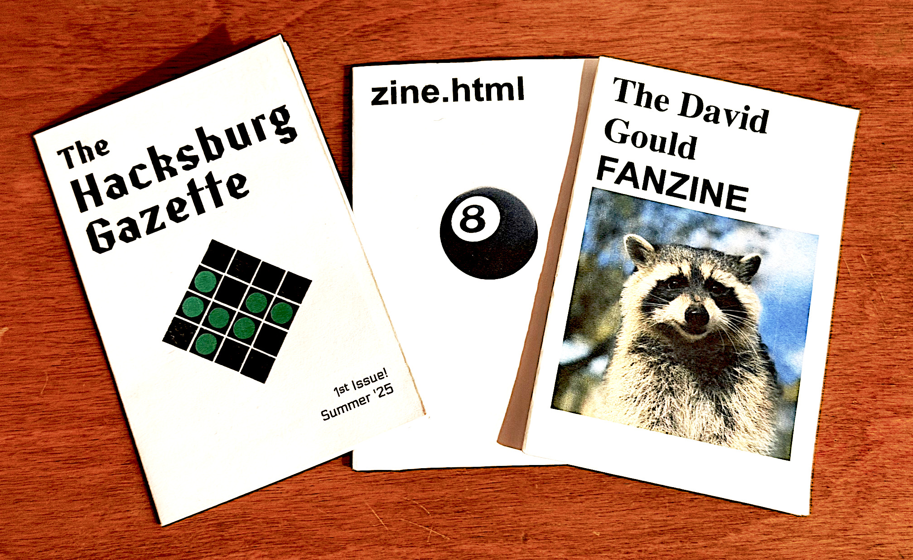
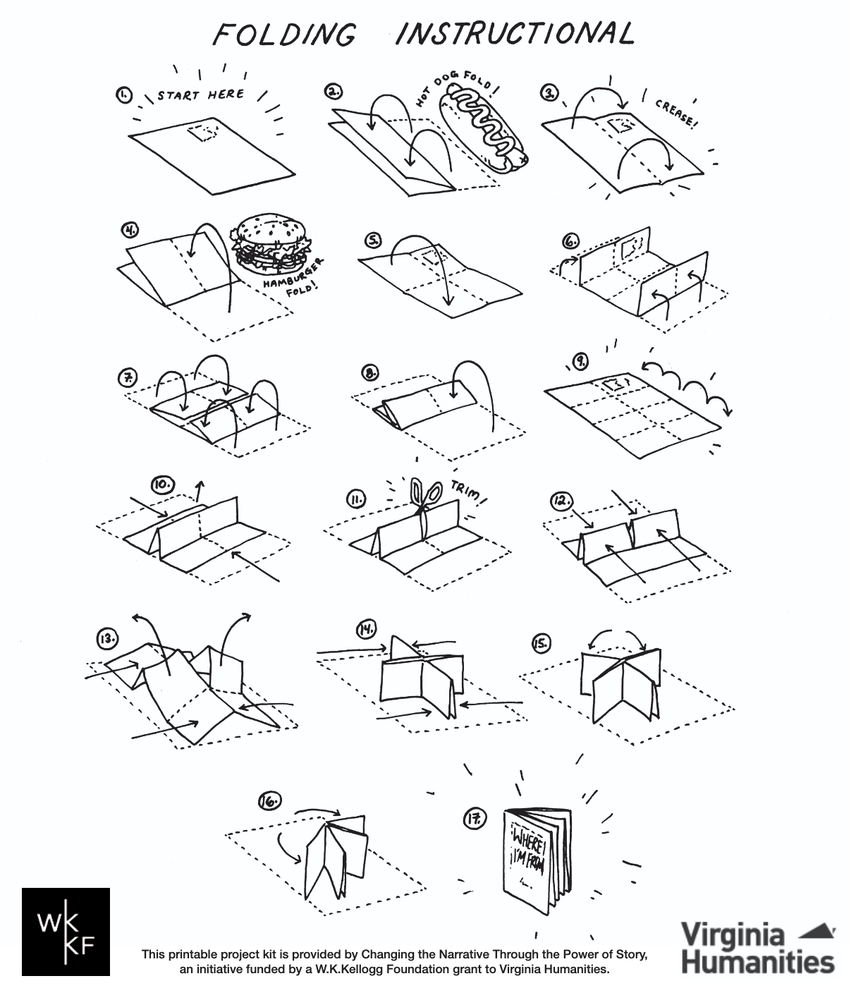
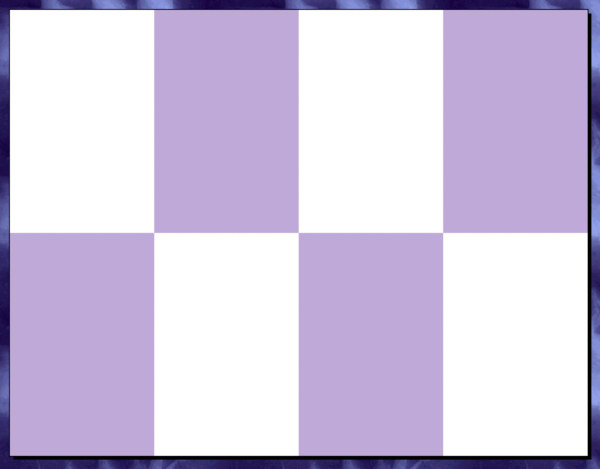

# if you have a printer, you're a publisher

1. open <a href="">zine workshop  ↗</a> in your web browser
2. flesh out the pages using HTML
3. press ```⌘ + P``` to print an 8-page mini zine to one sheet of 8.5 x 11" legal paper



>[!NOTE]
>for best results, in your system print dialog...
>- ensure Portrait orientation is selected
>- set Margins to None or 0
>- select "Scale 100%" rather than "Fit to page width"
>- check "Print backgrounds" to ensure proper styling

## assembly

once you've printed your zine, follow this assembly guide from <a href="https://vabook.org/wp-content/uploads/sites/16/2020/03/Where-Im-From-zine-folding-instructions.pdf">Virginia Center for the Book</a> to cut and fold it to shape:

<a href="https://vabook.org/wp-content/uploads/sites/16/2020/03/Where-Im-From-zine-folding-instructions.pdf">
    
</a>

>[!TIP]
>once assembled, use a gluestick to increase your zine's structural stability (add glue to the back of the purple sections):
>
>

# cool zine ideas:
- comic book
- recipe book
- album review
- photo album
- dream journal
- poem collection
- manifesto

# licenses and acknowledgements

this project is licensed under the [GNU General Public License v3.0](LICENSE).

## technologies used

- [CodeMirror 6](https://codemirror.net/)
- [GitHub Dark Theme for CodeMirror](https://github.com/fsegurai/codemirror-themes)

## font licenses

| font | license |
|------|---------|
| Baskervvile | [SIL Open Font License](resources/fonts/baskervvile/OFL.txt) |
| Basteleur | [SIL Open Font License](resources/fonts/basteleur-master/LICENSE.txt) |
| CatShop | [SIL Open Font License](resources/fonts/CatShop/Open%20Font%20License.txt) |
| CutMeOut | [SIL Open Font License](resources/fonts/CutMeOut/Open%20Font%20License.txt) |
| Electrolize | [SIL Open Font License](resources/fonts/Electrolize/OFL.txt) |
| ElbtunnelTT | [Creative Commons](resources/fonts/ElbtunnelTT/Creative%20Commons%20Lizenz.txt) |
| ElbtunnelTT2 | [Creative Commons](resources/fonts/ElbtunnelTT2/Creative%20Commons%20Lizenz.txt) |
| Eureka | [SIL Open Font License](resources/fonts/Eureka/Open%20Font%20License.txt) |
| Eyechart | [SIL Open Font License](resources/fonts/Eyechart/Open%20Font%20License.txt) |
| Immermann | [SIL Open Font License](resources/fonts/Immermann/Open%20Font%20License.txt) |
| Impact Label | [Tension Type Free Font License](resources/fonts/impact-label/Tension%20Type%20Font%20License.txt) |
| Indira_K | [SIL Open Font License](resources/fonts/Indira_K/OFL.txt) |
| Instrument_Serif | [SIL Open Font License](resources/fonts/Instrument_Serif/OFL.txt) |
| Kanalisirung | [SIL Open Font License](resources/fonts/Kanalisirung/OFL.txt) |
| Karrik | [SIL Open Font License](resources/fonts/karrik_fonts-main/LICENCE.txt) |
| MMX2010 | [SIL Open Font License](resources/fonts/MMX2010/Open%20Font%20License.txt) |
| Mon_Hugo | [SIL Open Font License](resources/fonts/Mon_Hugo_freefont/FREE%20FONT%20LICENSE.txt) |
| Murrx | [SIL Open Font License](resources/fonts/Murrx/Open%20Font%20License.txt) |
| Néo-castel | [OIFL (French OFL)](resources/fonts/Néo-castel/Licence.txt) |
| OUEST | [OIFL (French OFL)](resources/fonts/OUEST/license.txt) |
| Resistance générale | [SIL Open Font License](resources/fonts/resistance-generale-master/LICENSE.txt) |
| Special_Gothic_Expanded_One | [SIL Open Font License](resources/fonts/Special_Gothic_Expanded_One/OFL.txt) |
